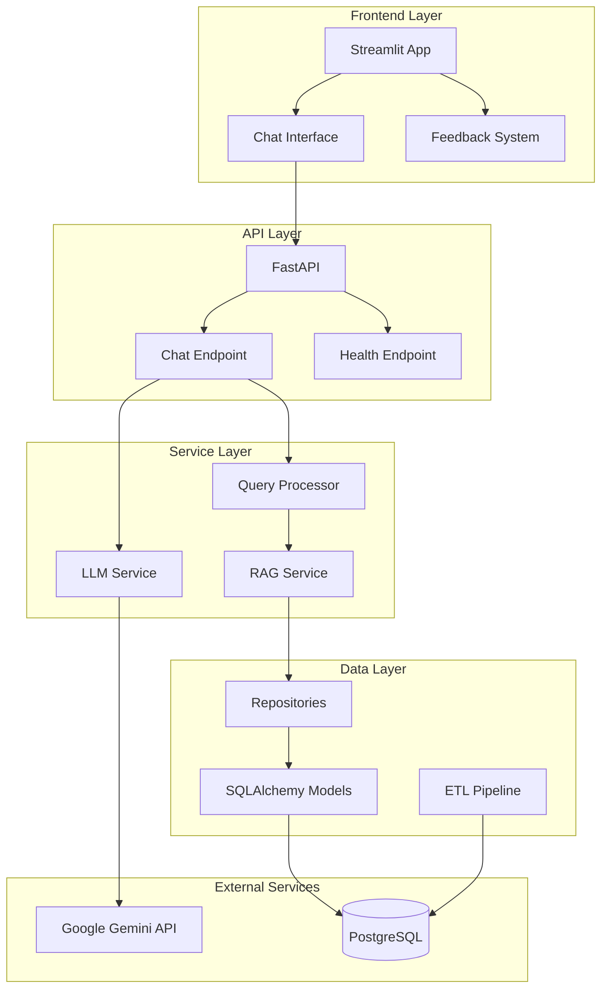
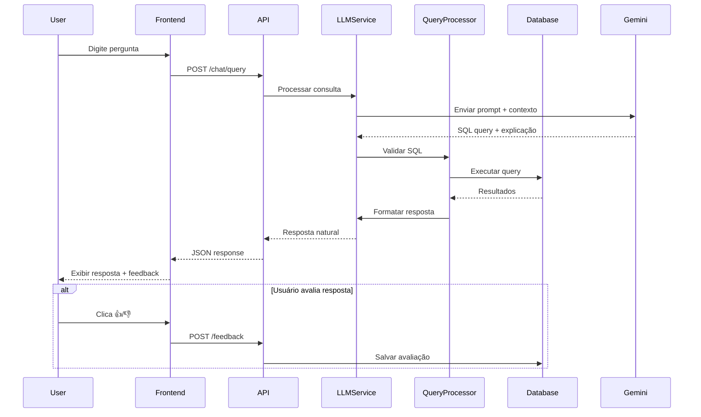
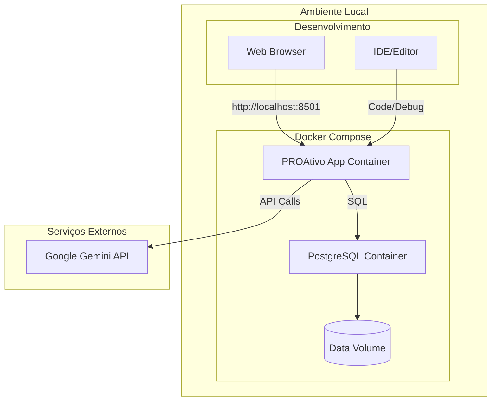

# Arquitetura de Software - PROAtivo: Sistema Inteligente de Apoio à Decisão

## 1. Visão Geral da Solução

O PROAtivo é um sistema de apoio à decisão baseado em IA que permite consultas em linguagem natural sobre dados de manutenção de ativos elétricos. A solução adota uma arquitetura em camadas com separação clara de responsabilidades, utilizando tecnologias modernas e padrões consolidados.

**Stack Tecnológico:**
- **Backend:** Python 3.8+ com FastAPI para APIs REST
- **Frontend:** Streamlit para interface web conversacional
- **Banco de Dados:** PostgreSQL 13+ para persistência estruturada
- **IA/LLM:** Google Gemini 2.5 Flash via API REST
- **Containerização:** Docker e Docker Compose
- **ORM:** SQLAlchemy para mapeamento objeto-relacional
- **Processamento:** Pandas, OpenPyXL para manipulação de planilhas

**Justificativa Técnica:**
A arquitetura prioriza simplicidade e rapidez de desenvolvimento para um protótipo, mantendo extensibilidade futura. FastAPI oferece performance e documentação automática, enquanto Streamlit acelera o desenvolvimento da interface. PostgreSQL garante robustez para dados estruturados.

## 2. Requisitos Não Funcionais

### Desempenho
- **Tempo de Resposta:** ≤ 10 segundos para 95% das consultas
- **Throughput:** Suporte a 5-10 usuários simultâneos (protótipo)
- **Latência API:** ≤ 2 segundos para processamento interno

### Disponibilidade
- **SLA:** 95% de disponibilidade durante horário comercial
- **Recovery Time:** ≤ 5 minutos para restart de serviços
- **Tolerância a Falhas:** Graceful degradation com mensagens informativas

### Escalabilidade
- **Arquitetura:** Preparada para scale-out horizontal
- **Componentes Stateless:** APIs sem estado para facilitar replicação
- **Separação de Responsabilidades:** Camadas independentes

### Manutenibilidade
- **Logging:** Estruturado com níveis apropriados (INFO, ERROR, DEBUG)
- **Monitoramento:** Health checks e métricas básicas
- **Documentação:** OpenAPI/Swagger automático via FastAPI

### Segurança (Básica)
- **Validação:** Input validation em todas as entradas
- **CORS:** Configurado adequadamente para desenvolvimento
- **Secrets:** Variáveis de ambiente para API keys

## 3. Padrões de Projeto Utilizados

### Repository Pattern
**Justificativa:** Abstrai acesso a dados, facilitando testes e mudanças futuras no banco.
**Aplicação:** Camada de repositórios para equipamentos e manutenções.

### Service Layer Pattern
**Justificativa:** Encapsula lógica de negócio complexa e coordena operações entre repositórios.
**Aplicação:** Services para LLM, RAG e processamento de queries.

### Adapter Pattern
**Justificativa:** Integração com APIs externas (Google Gemini) sem acoplamento forte.
**Aplicação:** Adapter para comunicação com diferentes LLMs futuros.

### Factory Pattern
**Justificativa:** Criação de processadores específicos para diferentes formatos de arquivo.
**Aplicação:** Factory para processadores CSV, XML, XLSX.

### Dependency Injection
**Justificativa:** Facilita testes unitários e substituição de implementações.
**Aplicação:** Injeção de repositórios e services via FastAPI.

## 4. Estrutura Inicial da Solução

```
/proativo
├── /src
│   ├── /api
│   │   ├── /endpoints
│   │   │   ├── chat.py
│   │   │   ├── health.py
│   │   │   ├── cache_demo.py
│   │   │   ├── fallback_demo.py
│   │   │   └── feedback.py
│   │   ├── /services
│   │   │   ├── llm_service.py
│   │   │   ├── rag_service.py
│   │   │   ├── query_processor.py
│   │   │   ├── cache_service.py
│   │   │   ├── fallback_service.py
│   │   │   ├── sql_validator.py
│   │   │   └── prompt_templates.py
│   │   ├── /models
│   │   │   └── chat.py
│   │   ├── config.py
│   │   ├── dependencies.py
│   │   └── main.py
│   ├── /database
│   │   ├── connection.py
│   │   ├── models.py
│   │   └── repositories.py
│   ├── /etl
│   │   ├── data_processor.py
│   │   ├── data_ingestion.py
│   │   ├── exceptions.py
│   │   └── processors/
│   │       ├── csv_processor.py
│   │       ├── xml_processor.py
│   │       └── xlsx_processor.py
│   ├── /frontend
│   │   ├── app.py
│   │   └── /components
│   │       ├── chat_interface.py
│   │       └── feedback.py
│   └── /utils
│       ├── validators.py
│       ├── error_handlers.py
│       └── logger.py
├── /tests
│   ├── /unit
│   │   ├── test_llm_service.py
│   │   ├── test_rag_service.py
│   │   ├── test_query_processor.py
│   │   ├── test_cache_service.py
│   │   └── test_fallback_service.py
│   ├── /integration
│   │   └── test_complete_pipeline.py
│   └── conftest.py
├── /docs
│   ├── arquitetura-camada-ia-proativo.md
│   ├── estrutura-banco-dados.md
│   ├── llm-service-detalhado.md
│   ├── pipeline-etl-explicacao-usuarios.md
│   ├── relatorio-camada-llm-proativo.md
│   └── sistema-tratamento-erros.md
├── /data
│   ├── /samples
│   │   ├── electrical_assets.xlsx
│   │   ├── equipment.csv
│   │   ├── equipment.xml
│   │   ├── failures_incidents.csv
│   │   ├── maintenance_orders.csv
│   │   ├── maintenance_orders.xml
│   │   ├── maintenance_schedules.csv
│   │   ├── spare_parts.csv
│   │   └── equipment_spare_parts.csv
│   ├── SAP.csv
│   └── /uploads
├── /scripts
│   └── benchmark_pipeline.py
├── /logs
├── /init-scripts
├── .env.example
├── .env
├── requirements.txt
├── pyproject.toml
├── uv.lock
├── docker-compose.yml
├── Dockerfile
├── main.py
├── test_config.py
├── test_etl_pipeline.py
├── test_integration.py
├── validate_system.py
├── integration_test_report.md
└── README.md
```

## 5. Arquitetura de Componentes

### Descrição dos Módulos

**Frontend Layer (Streamlit)**
- **Responsabilidade:** Interface de usuário conversacional
- **Componentes:** Chat interface, sistema de feedback, validações

**API Layer (FastAPI)**
- **Responsabilidade:** Endpoints REST, validação, orquestração
- **Componentes:** Controllers, middleware, documentação automática

**Service Layer**
- **Responsabilidade:** Lógica de negócio, integração com IA
- **Componentes:** LLM Service, RAG Service, Query Processor, Cache Service, Fallback Service, SQL Validator, Prompt Templates

**Data Layer**
- **Responsabilidade:** Persistência, ETL, modelos de dados
- **Componentes:** Repositories, Models, Data Processors

### Serviços Implementados

**LLM Service (llm_service.py)**
- **Responsabilidade:** Integração com Google Gemini 2.5 Flash
- **Funcionalidades:** Geração de respostas, validação, retry automático

**RAG Service (rag_service.py)**
- **Responsabilidade:** Recuperação de contexto relevante
- **Funcionalidades:** Indexação de documentos, busca semântica, ranking

**Query Processor (query_processor.py)**
- **Responsabilidade:** Análise de linguagem natural
- **Funcionalidades:** Identificação de intenções, geração de SQL, validação

**Cache Service (cache_service.py)**
- **Responsabilidade:** Cache inteligente de respostas
- **Funcionalidades:** Normalização de queries, detecção de similaridade, TTL

**Fallback Service (fallback_service.py)**
- **Responsabilidade:** Respostas alternativas quando LLM falha
- **Funcionalidades:** Detecção de problemas, templates de resposta, sugestões

**SQL Validator (sql_validator.py)**
- **Responsabilidade:** Validação e sanitização de SQL
- **Funcionalidades:** Prevenção de injection, análise de complexidade, whitelisting

**Prompt Templates (prompt_templates.py)**
- **Responsabilidade:** Templates especializados por tipo de consulta
- **Funcionalidades:** Prompts otimizados, contextualização, exemplos

### Diagrama de Componentes



## 6. Diagrama de Sequência



## 7. Diagrama de Implantação



## 8. Pontos Críticos / Riscos Técnicos

### Riscos de Alta Prioridade

**Dependência Externa: Google Gemini API**
- **Risco:** Indisponibilidade ou mudanças na API
- **Mitigação:** Implementar circuit breaker e fallback responses

**Qualidade das Respostas**
- **Risco:** LLM pode gerar SQL incorreto ou respostas inadequadas
- **Mitigação:** Validação rigorosa de SQL, sandbox para execução

**Performance do LLM**
- **Risco:** Latência alta em consultas complexas
- **Mitigação:** Cache de respostas, timeout apropriado

### Riscos de Média Prioridade

**Volumetria de Dados**
- **Risco:** Performance degradada com grandes datasets
- **Mitigação:** Indexação adequada, paginação de resultados

**Validação de Dados de Entrada**
- **Risco:** Dados inconsistentes nas planilhas
- **Mitigação:** Validação robusta na pipeline ETL

## 9. Dependências

### Dependências Técnicas
- **Google Gemini API:** Chave de API válida e conectividade internet
- **PostgreSQL 13+:** Para funcionalidades SQL avançadas
- **Docker & Docker Compose:** Para containerização local
- **Python 3.8+:** Compatibilidade com bibliotecas modernas

### Dependências Externas
- **Conectividade Internet:** Para acesso à API do Gemini
- **Dados de Exemplo:** Planilhas sample para testes iniciais
- **API Key Management:** Sistema para gerenciar credenciais

### Dependências de Desenvolvimento
- **pytest:** Framework de testes
- **pre-commit:** Hooks para qualidade de código
- **black/flake8:** Formatação e linting

## 10. Observações Finais

### Decisões de Design

**Arquitetura Monolítica Modular**
Escolhida por simplicidade do protótipo, mas com separação clara para futuro refactoring para microserviços se necessário.

**State Management**
Sistema stateless para facilitar scaling horizontal futuro. Estado de sessão mantido apenas no frontend.

**Error Handling**
Estratégia defensiva com fallbacks graceful e logging detalhado para debugging eficiente.

### Próximos Passos Recomendados

1. **Implementar MVP** com funcionalidades core
2. **Definir Schema de Dados** baseado em planilhas reais
3. **Configurar Pipeline CI/CD** básica
4. **Estabelecer Métricas** de qualidade das respostas

### Dúvidas para Alinhamento

- **Formato exato das planilhas** de entrada (schema)
- **Critérios específicos** para validação de respostas do LLM
- **Estratégia de backup** para dados de produção (se aplicável)

---

**Versão:** 1.0  
**Data:** Janeiro 2025  
**Arquiteto:** Sistema PROAtivo  
**Status:** Proposta Inicial 