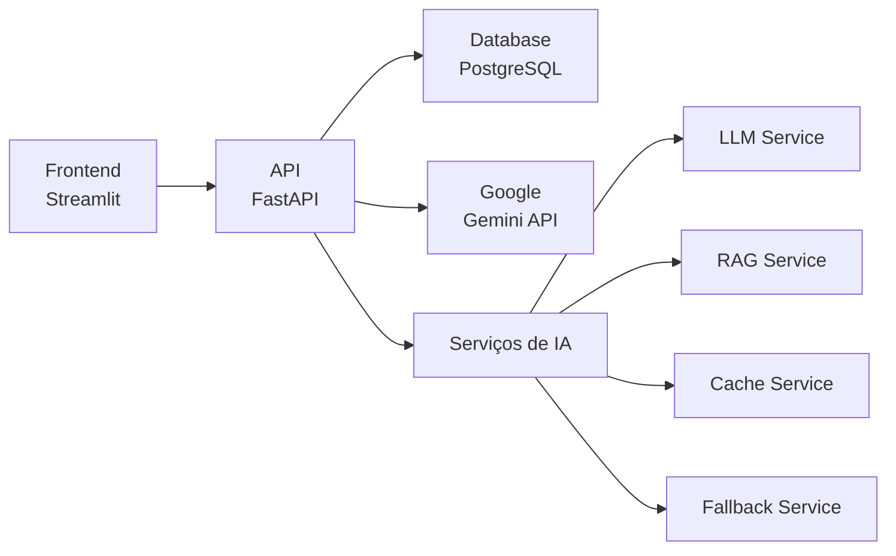

# PROAtivo - Sistema Inteligente de Apoio à Decisão

[](https://www.python.org/downloads/)
[](https://fastapi.tiangolo.com/)
[](https://www.postgresql.org/)
[](https://www.docker.com/)
[]()

Sistema conversacional inteligente para consultas em linguagem natural sobre dados de manutenção de ativos elétricos, utilizando **Google Gemini 2.5 Flash** com implementação **RAG** (Retrieval-Augmented Generation).

## ✨ Principais Características

- 🤖 **IA Conversacional** com Google Gemini 2.5 Flash
- 🔍 **Sistema RAG** para recuperação contextual de informações  
- 📊 **Pipeline ETL** automatizado (CSV, XML, XLSX)
- 🧠 **Cache Inteligente** com detecção de similaridade
- 🛡️ **Sistema de Fallback** robusto
- 🔒 **Validação SQL** avançada com prevenção de injection
- 🎨 **Interface Web** moderna com Streamlit
- 📈 **Sistema de Feedback** e métricas de qualidade
- 🐳 **Containerização** completa com Docker

## 🚀 Quick Start

### 1. Pré-requisitos
- [Docker Desktop](https://www.docker.com/products/docker-desktop/) instalado
- Chave da API do Google Gemini ([obter aqui](https://ai.google.dev/))

### 2. Configuração
```bash
# Clone o repositório
git clone https://github.com/gtaquino-automatelabs/proativo.git
cd proativo/proativo

# Configure variáveis de ambiente
cp .env.example .env
# Edite o .env e adicione sua GOOGLE_API_KEY
```

### 3. Execução
```bash
# Inicie todos os serviços
docker-compose up -d

# Aguarde os containers iniciarem (30-60 segundos)
docker-compose logs -f  # Opcional: acompanhar logs
```

### 4. Inicialização Automática Inteligente 🚀
```bash
# A inicialização é totalmente AUTOMÁTICA via Docker! 🎉
# O sistema configura automaticamente:
# ✅ Criação de todas as tabelas
# ✅ População de dados básicos (equipamentos, manutenções, falhas)
# ✅ Importação de localidades SAP
# ✅ Correlação de equipamentos com localidades
# ✅ População de dados PMM_2
# ✅ Verificação final da integridade

# Valide a instalação (opcional)
python scripts/testing/validate_system.py        # Verificação completa
```

🎯 **Verificação Granular**: O sistema analisa cada tabela individualmente e executa apenas os scripts necessários para popular tabelas vazias!

🚀 **Sem configuração manual necessária** - tudo é configurado automaticamente durante a inicialização!

### 5. Primeiro Uso
1. Acesse o **frontend** em http://localhost:8501
2. Comece a fazer consultas em linguagem natural:
   - *"Quantos transformadores estão operacionais?"*
   - *"Manutenções programadas para esta semana"*
   - *"Equipamentos com mais falhas este ano"*
   - *"Histórico de incidentes dos últimos 6 meses"*
3. **Opcional**: Faça upload de seus próprios arquivos CSV/XML/XLSX

## 🏗️ Arquitetura



### Estrutura do Projeto
```
proativo/
├── src/
│   ├── api/              # FastAPI backend
│   ├── database/         # Modelos e repositórios
│   ├── etl/              # Pipeline de dados
│   ├── frontend/         # Interface Streamlit
│   └── utils/            # Utilitários compartilhados
├── tests/                # Testes unitários e integração
├── scripts/              # Scripts de validação
├── docs/                 # Documentação técnica
├── data/samples/         # Dados de exemplo
└── docker-compose.yml    # Orquestração dos serviços
```

## 🛠️ Desenvolvimento

### Comandos Úteis
```bash
# Logs em tempo real
docker-compose logs -f

# Executar testes
pytest tests/

# Validar sistema
python scripts/validate_system.py

# Rebuild da aplicação
docker-compose build --no-cache
```

### Configuração Local
```bash
# Instalar dependências (recomendado: UV)
uv sync

# Ou usar pip
pip install -r requirements.txt

# Executar testes com cobertura
pytest tests/ --cov=src/ --cov-report=html
```

## 🔧 Configuração Avançada

### Variáveis de Ambiente Principais
```bash
# Obrigatório
GOOGLE_API_KEY=your_api_key_here

# Opcionais (têm valores padrão)
GEMINI_MODEL=gemini-2.5-flash
GEMINI_TEMPERATURE=0.1
DATABASE_URL=postgresql+asyncpg://...
```

### Serviços de IA Implementados
- **LLM Service**: Integração com Gemini + retry automático
- **RAG Service**: Busca semântica e ranking de relevância  
- **Query Processor**: Análise de linguagem natural
- **Cache Service**: Cache inteligente com TTL dinâmico
- **Fallback Service**: Respostas alternativas quando LLM falha
- **SQL Validator**: Prevenção de injection + sanitização

## 📖 Documentação

### Documentação Técnica Detalhada
- 📐 [Arquitetura da Camada de IA](docs/arquitetura-camada-ia-proativo.md)
- 🗄️ [Estrutura do Banco de Dados](docs/estrutura-banco-dados.md)
- 🤖 [LLM Service Detalhado](docs/llm-service-detalhado.md)
- 📊 [Pipeline ETL](docs/pipeline-etl-explicacao-usuarios.md)
- 🛡️ [Sistema de Tratamento de Erros](docs/sistema-tratamento-erros.md)

### APIs e Monitoramento
- **API Docs**: http://localhost:8000/docs
- **Health Check**: http://localhost:8000/health
- **Métricas**: http://localhost:8000/metrics
- **PgAdmin**: http://localhost:5050

## 🧪 Testes e Validação

### Suite de Testes
- **Testes Unitários**: 85%+ cobertura
- **Testes de Integração**: Pipeline completo end-to-end
- **Scripts de Validação**: Sistema automatizado

### Scripts Utilitários
```bash
# Validação completa do sistema
python scripts/validate_system.py

# Testes de integração simulados  
python scripts/test_integration.py

# Validação específica do ETL
python scripts/test_etl_pipeline.py
```

## 🔒 Segurança

- ✅ Container não-root + validação de entrada rigorosa
- ✅ Prevenção SQL injection + sanitização completa
- ✅ CORS configurado + rate limiting
- ✅ Não exposição de dados sensíveis em logs

## 🐛 Solução de Problemas

### Problemas Comuns

**Container não inicia**: `docker-compose logs [service]`  
**API não responde**: `curl http://localhost:8000/health`  
**Gemini API erro**: Verificar `GOOGLE_API_KEY` no `.env`  
**Logs detalhados**: Definir `LOG_LEVEL=DEBUG` no `.env`  

### Sistema Sem Dados
❌ **Chat responde "Não há dados" ou "Tabelas vazias"**  
✅ **Solução**: A inicialização é automática. Se ainda assim não há dados:
```bash
# Execute manualmente a configuração completa
python scripts/setup/setup_complete_database.py
```

### URLs de Acesso
- **Frontend**: http://localhost:8501
- **API**: http://localhost:8000  
- **Docs**: http://localhost:8000/docs
- **Health**: http://localhost:8000/health  

## 🤝 Contribuição

1. Fork o projeto
2. Crie uma branch: `git checkout -b feature/nova-feature`
3. Execute os testes: `pytest tests/`
4. Submeta um Pull Request

## 📊 Status do Projeto

**Versão Atual**: 2.0 - Sistema de IA Completo ✅  
**Status**: Protótipo Funcional e Validado 🚀  
**Cobertura de Testes**: 85%+ 🧪  

### Próximas Funcionalidades
- Dashboard de métricas em tempo real
- Suporte a mais formatos de arquivo  
- Sistema de autenticação
- Deployment para produção

## 📄 Licença & Contatos

**Repositório**: https://github.com/gtaquino-automatelabs/proativo  
**Licença**: [A definir]  
**Issues**: Use o GitHub Issues para reportar problemas  

---
*Sistema desenvolvido para pesquisa acadêmica com foco em apoio à decisão para manutenção de ativos elétricos.* 