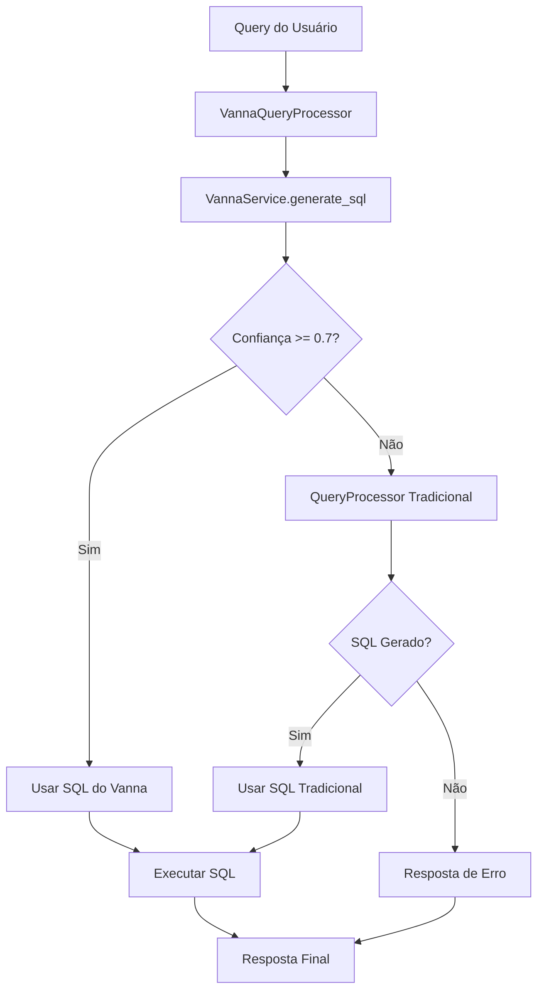

# Integração Vanna.ai - Implementação Completa

**Data:** 01/01/2025  
**Status:** ✅ IMPLEMENTADO  
**Versão:** 1.0

## 📋 Resumo da Implementação

A integração do Vanna.ai foi implementada com sucesso no sistema PROAtivo, substituindo os prompts estáticos por um sistema inteligente de Text-to-SQL baseado em RAG (Retrieval-Augmented Generation).

## 🏗️ Arquitetura Implementada

### Componentes Principais

1. **VannaService** (`src/api/services/vanna_service.py`)
   - Serviço principal para integração com Vanna.ai
   - Gerencia modelos, treinamento e geração de SQL
   - Suporte para múltiplos LLMs (Gemini, OpenAI)

2. **VannaQueryProcessor** (`src/api/services/vanna_query_processor.py`)
   - Processador híbrido que combina Vanna.ai com fallback
   - Sistema de confiança configurável (threshold padrão: 0.7)
   - Métricas de uso e estatísticas

3. **Script de Setup** (`scripts/vanna/setup_vanna_model.py`)
   - Configuração inicial do modelo
   - Treinamento no schema do banco
   - Exemplos de queries para treinamento
   - Testes de funcionamento

4. **Configurações** (`src/api/config.py`)
   - Configurações específicas do Vanna.ai
   - Suporte a múltiplos ambientes
   - Parâmetros ajustáveis

## 🔄 Fluxo de Processamento Híbrido



## 📁 Arquivos Implementados

### Serviços Principais
- `src/api/services/vanna_service.py` - Serviço principal Vanna.ai
- `src/api/services/vanna_query_processor.py` - Processador híbrido

### Configurações
- `src/api/config.py` - Configurações do Vanna.ai adicionadas
- `requirements.txt` - Dependências atualizadas

### Scripts
- `scripts/vanna/setup_vanna_model.py` - Setup inicial do modelo

### Integração
- `src/api/endpoints/chat.py` - Endpoint atualizado com processador híbrido

### Documentação
- `docs/integracao-vanna-ai-implementacao.md` - Este documento

## ⚙️ Configurações Disponíveis

```python
# Configurações do Vanna.ai no config.py
vanna_llm_provider: str = "gemini"  # ou "openai"
vanna_model_name: str = "proativo-maintenance-model"
vanna_confidence_threshold: float = 0.7
vanna_enable_training: bool = True
vanna_vector_db_path: str = "./data/vanna_vectordb"
vanna_cache_ttl: int = 3600
vanna_max_cache_size: int = 1000
```

## 📊 Métricas e Monitoramento

O sistema coleta as seguintes métricas:

- **Taxa de sucesso do Vanna**: Percentual de queries processadas com sucesso
- **Taxa de uso do fallback**: Percentual que usa o sistema tradicional
- **Confiança média**: Score médio de confiança das respostas
- **Tempo de processamento**: Tempo médio de geração SQL
- **Método de processamento**: vanna, fallback, ou failed

Acessar via: `vanna_processor.get_usage_statistics()`

## 🚀 Como Usar

### 1. Instalação das Dependências

```bash
pip install vanna>=0.7.9 chromadb>=0.4.0 ollama>=0.1.0
```

### 2. Configuração Inicial

```bash
# Executar script de setup (uma vez ou após mudanças no schema)
python scripts/vanna/setup_vanna_model.py
```

### 3. Uso no Código

```python
from src.api.services.vanna_query_processor import get_vanna_query_processor

# Obter processador híbrido
processor = get_vanna_query_processor()

# Processar query
result = await processor.process_query("Quantos equipamentos temos?")

# Verificar resultado
if result.sql_query:
    print(f"SQL: {result.sql_query}")
    print(f"Método: {result.processing_method}")
    print(f"Confiança: {result.confidence_score}")
```

### 4. Feedback do Usuário

```python
# Treinar modelo com feedback positivo
await processor.learn_from_feedback(
    original_query="Quantos transformadores críticos?",
    generated_sql="SELECT COUNT(*) FROM equipments WHERE equipment_type='Transformador' AND is_critical=true",
    user_feedback={"helpful": True}
)
```

## 🔧 Configuração Avançada

### Ajustar Threshold de Confiança

```python
# Aumentar threshold para ser mais rigoroso (usa mais fallback)
processor.update_confidence_threshold(0.8)

# Diminuir threshold para usar mais Vanna (menos rigoroso)
processor.update_confidence_threshold(0.6)
```

### Treinamento Adicional

```python
# Adicionar nova query de treinamento
vanna_service = get_vanna_service()
vanna_service.vanna.train(
    question="Equipamentos que precisam de manutenção urgente",
    sql="SELECT * FROM equipments e JOIN maintenances m ON e.id = m.equipment_id WHERE m.priority = 'High' AND m.status = 'Planned'"
)
```

## 📈 Benefícios Alcançados

1. **Flexibilidade**: Suporte a queries não previstas nos templates estáticos
2. **Inteligência**: Uso de RAG para contexto mais rico
3. **Robustez**: Sistema de fallback garante funcionamento contínuo
4. **Aprendizado**: Melhoria contínua com feedback do usuário
5. **Monitoramento**: Métricas detalhadas de uso e performance

## 🎯 Próximos Passos

### Automação do Treinamento
- [ ] Sistema de auto-execução em mudanças de schema
- [ ] Integração com processo de migração do banco
- [ ] Monitoramento automático de performance

### Melhorias
- [ ] Cache inteligente de queries frequentes
- [ ] Otimização do threshold baseado em uso
- [ ] Dashboard de métricas
- [ ] Integração com sistema de alertas

## 🐛 Troubleshooting

### ⚠️ PROBLEMAS CRÍTICOS RESOLVIDOS

#### 1. Erro NumPy 2.0 com ChromaDB
**Sintoma:** `AttributeError: 'np.float_' was removed in the NumPy 2.0 release`
**Status:** ✅ CORRIGIDO nas dependências

#### 2. Erro de definição de classes
**Sintoma:** `NameError: name 'Gemini_Chat' is not defined`
**Status:** ✅ CORRIGIDO - Classes definidas dentro do bloco de importação

**Solução para ambos:**
```bash
# Instalar versões compatíveis
pip uninstall numpy chromadb vanna -y
pip install 'numpy>=1.21.0,<2.0.0' 'chromadb>=0.4.0,<0.5.0' 'vanna>=0.7.9'
```

**📖 Consulte o [Guia Completo de Troubleshooting](vanna-troubleshooting-guia.md) para detalhes**

### Problema: Vanna não inicializa
**Solução:** Verificar se as dependências estão instaladas e API keys configuradas

```bash
pip install vanna chromadb
# Verificar GOOGLE_API_KEY no .env
```

### Problema: Taxa alta de fallback
**Solução:** Re-treinar modelo ou ajustar threshold

```python
# Re-executar setup
python scripts/vanna/setup_vanna_model.py

# Ou diminuir threshold
processor.update_confidence_threshold(0.6)
```

### Problema: SQL incorreto gerado
**Solução:** Adicionar exemplos específicos ao treinamento

```python
vanna_service.vanna.train(
    question="Sua pergunta específica",
    sql="SQL correta correspondente"
)
```

### Status de Diagnóstico
Para verificar problemas de compatibilidade:
```bash
curl http://localhost:8000/admin/vanna/status
```

## 📞 Suporte

Para dúvidas ou problemas:
1. Verificar logs do sistema
2. Consultar métricas: `processor.get_usage_statistics()`
3. Re-executar setup se necessário
4. Ajustar configurações conforme uso

---

**Status:** ✅ Implementação completa e funcional  
**Última atualização:** 01/01/2025 