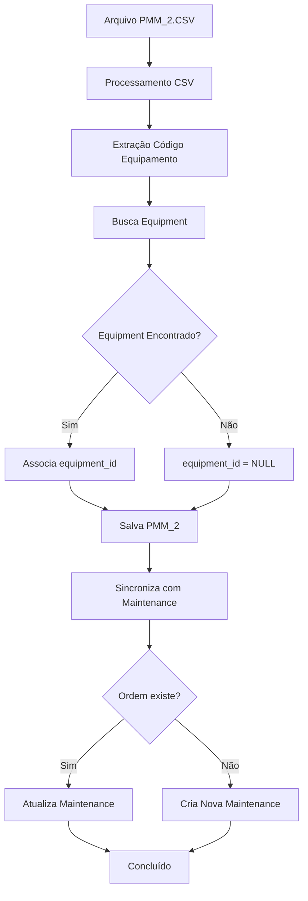

# PMM_2 - Diagrama de Relacionamento

## Visão Geral dos Relacionamentos

O sistema PMM_2 (Plano de Manutenção Mestre) estabelece relacionamentos estratégicos com as tabelas existentes `Equipment` e `Maintenance`, criando um ecossistema integrado de gestão de manutenção.

## Relacionamentos Principais

### 1. PMM_2 ↔ Equipment (N:1)
**Cardinalidade**: Muitos planos PMM_2 para um equipamento
**Relacionamento**: `pmm_2_maintenance_plans.equipment_id` → `equipments.id`

```sql
-- Chave estrangeira
ALTER TABLE pmm_2_maintenance_plans 
ADD CONSTRAINT fk_pmm2_equipment 
FOREIGN KEY (equipment_id) REFERENCES equipments(id) ON DELETE SET NULL;
```

**Estratégia de Associação**:
```python
def associate_equipment(installation_location: str) -> Optional[str]:
    """
    Associa plano PMM_2 com equipamento baseado na localização
    
    Exemplo:
    installation_location: "MT-S-70113-FE01-CH-301F7T"
    ↓ Extrai código do equipamento
    equipment_code: "CH-301F7T"
    ↓ Busca no banco
    SELECT id FROM equipments WHERE code = 'CH-301F7T'
    """
    # Extrai código do equipamento
    equipment_code = extract_equipment_code(installation_location)
    
    # Busca equipamento por código
    equipment = get_equipment_by_code(equipment_code)
    
    if equipment:
        return equipment.id
    
    # Fallback: busca por localização
    equipment = get_equipment_by_location(installation_location)
    
    return equipment.id if equipment else None
```

### 2. PMM_2 ↔ Maintenance (1:0..1)
**Cardinalidade**: Um plano PMM_2 pode gerar zero ou uma manutenção
**Relacionamento**: `pmm_2_maintenance_plans.current_order_number` → `maintenances.maintenance_code`

```sql
-- Não é uma FK formal, mas relacionamento via código
SELECT m.* 
FROM maintenances m 
JOIN pmm_2_maintenance_plans p ON m.maintenance_code = p.current_order_number;
```

**Estratégia de Sincronização**:
```python
def sync_pmm2_with_maintenance(pmm2_plan: PMM2MaintenancePlan):
    """
    Sincroniza plano PMM_2 com registro de manutenção
    """
    if not pmm2_plan.current_order_number:
        return
    
    # Busca manutenção existente
    maintenance = get_maintenance_by_code(pmm2_plan.current_order_number)
    
    if not maintenance:
        # Cria nova manutenção baseada no PMM_2
        maintenance_data = {
            "equipment_id": pmm2_plan.equipment_id,
            "maintenance_code": pmm2_plan.current_order_number,
            "maintenance_type": determine_maintenance_type(pmm2_plan.maintenance_item_description),
            "title": pmm2_plan.maintenance_item_description,
            "scheduled_date": pmm2_plan.planned_date,
            "start_date": pmm2_plan.scheduled_start_date,
            "completion_date": pmm2_plan.completion_date,
            "status": "Completed" if pmm2_plan.completion_date else "Planned",
            "priority": "Medium",
            "metadata_json": {
                "source": "PMM_2",
                "maintenance_plan_code": pmm2_plan.maintenance_plan_code,
                "work_center": pmm2_plan.work_center_responsible
            }
        }
        create_maintenance(maintenance_data)
    else:
        # Atualiza manutenção existente
        update_maintenance_from_pmm2(maintenance, pmm2_plan)
```

### 3. Equipment ↔ Maintenance (1:N)
**Cardinalidade**: Um equipamento tem múltiplas manutenções
**Relacionamento**: `maintenances.equipment_id` → `equipments.id`

```sql
-- Relacionamento existente
ALTER TABLE maintenances 
ADD CONSTRAINT fk_maintenance_equipment 
FOREIGN KEY (equipment_id) REFERENCES equipments(id) ON DELETE CASCADE;
```

## Fluxo de Dados Integrado

### 1. Processo de Ingestão PMM_2



### 2. Queries Comuns

#### Buscar Planos por Equipamento
```sql
SELECT 
    p.maintenance_plan_code,
    p.maintenance_item_description,
    p.planned_date,
    p.completion_date,
    e.code as equipment_code,
    e.name as equipment_name
FROM pmm_2_maintenance_plans p
JOIN equipments e ON p.equipment_id = e.id
WHERE e.code = 'CH-301F7T'
ORDER BY p.planned_date DESC;
```

#### Buscar Manutenções Relacionadas ao PMM_2
```sql
SELECT 
    p.maintenance_plan_code,
    p.work_center_responsible,
    m.maintenance_code,
    m.status,
    m.completion_date,
    e.code as equipment_code
FROM pmm_2_maintenance_plans p
JOIN equipments e ON p.equipment_id = e.id
LEFT JOIN maintenances m ON p.current_order_number = m.maintenance_code
WHERE p.planned_date >= '2025-01-01'
ORDER BY p.planned_date;
```

#### Dashboard de Status de Manutenção
```sql
SELECT 
    e.equipment_type,
    COUNT(p.id) as total_plans,
    COUNT(CASE WHEN p.completion_date IS NOT NULL THEN 1 END) as completed_plans,
    COUNT(CASE WHEN p.completion_date IS NULL AND p.planned_date < CURRENT_DATE THEN 1 END) as overdue_plans,
    AVG(CASE WHEN p.completion_date IS NOT NULL THEN 
        p.completion_date - p.planned_date 
    END) as avg_completion_delay
FROM pmm_2_maintenance_plans p
JOIN equipments e ON p.equipment_id = e.id
GROUP BY e.equipment_type
ORDER BY total_plans DESC;
```

## Integridade Referencial

### 1. Constraints de Relacionamento

```sql
-- PMM_2 → Equipment (SET NULL se equipamento for deletado)
ALTER TABLE pmm_2_maintenance_plans 
ADD CONSTRAINT fk_pmm2_equipment 
FOREIGN KEY (equipment_id) REFERENCES equipments(id) ON DELETE SET NULL;

-- Maintenance → Equipment (CASCADE se equipamento for deletado)
ALTER TABLE maintenances 
ADD CONSTRAINT fk_maintenance_equipment 
FOREIGN KEY (equipment_id) REFERENCES equipments(id) ON DELETE CASCADE;
```

### 2. Validações de Consistência

```sql
-- Função para validar consistência entre PMM_2 e Maintenance
CREATE OR REPLACE FUNCTION validate_pmm2_maintenance_consistency()
RETURNS TABLE(
    maintenance_plan_code VARCHAR(50),
    current_order_number VARCHAR(20),
    issue_description TEXT
) AS $$
BEGIN
    -- Planos PMM_2 com ordens que não existem em Maintenance
    RETURN QUERY
    SELECT 
        p.maintenance_plan_code,
        p.current_order_number,
        'Ordem não encontrada na tabela Maintenance' as issue_description
    FROM pmm_2_maintenance_plans p
    WHERE p.current_order_number IS NOT NULL
    AND NOT EXISTS (
        SELECT 1 FROM maintenances m 
        WHERE m.maintenance_code = p.current_order_number
    );
    
    -- Manutenções com equipamentos diferentes do PMM_2
    RETURN QUERY
    SELECT 
        p.maintenance_plan_code,
        p.current_order_number,
        'Equipamento diferente entre PMM_2 e Maintenance' as issue_description
    FROM pmm_2_maintenance_plans p
    JOIN maintenances m ON p.current_order_number = m.maintenance_code
    WHERE p.equipment_id != m.equipment_id;
    
    -- Datas inconsistentes
    RETURN QUERY
    SELECT 
        p.maintenance_plan_code,
        p.current_order_number,
        'Datas inconsistentes entre PMM_2 e Maintenance' as issue_description
    FROM pmm_2_maintenance_plans p
    JOIN maintenances m ON p.current_order_number = m.maintenance_code
    WHERE p.planned_date != m.scheduled_date
    OR p.completion_date != m.completion_date;
END;
$$ LANGUAGE plpgsql;
```

## Índices para Performance

### 1. Índices de Relacionamento

```sql
-- Índices para joins eficientes
CREATE INDEX idx_pmm2_equipment_id ON pmm_2_maintenance_plans(equipment_id);
CREATE INDEX idx_pmm2_current_order ON pmm_2_maintenance_plans(current_order_number);
CREATE INDEX idx_maintenance_equipment_id ON maintenances(equipment_id);
CREATE INDEX idx_maintenance_code ON maintenances(maintenance_code);

-- Índices compostos para queries comuns
CREATE INDEX idx_pmm2_equipment_planned_date 
ON pmm_2_maintenance_plans(equipment_id, planned_date);

CREATE INDEX idx_maintenance_equipment_scheduled_date 
ON maintenances(equipment_id, scheduled_date);
```

### 2. Índices para Análises

```sql
-- Índices para relatórios e dashboards
CREATE INDEX idx_pmm2_work_center_planned_date 
ON pmm_2_maintenance_plans(work_center_responsible, planned_date);

CREATE INDEX idx_pmm2_completion_status 
ON pmm_2_maintenance_plans(completion_date) 
WHERE completion_date IS NOT NULL;

CREATE INDEX idx_equipment_type_status 
ON equipments(equipment_type, status);
```

## Vistas (Views) Úteis

### 1. Vista Consolidada de Manutenção

```sql
CREATE VIEW v_maintenance_consolidated AS
SELECT 
    e.code as equipment_code,
    e.name as equipment_name,
    e.equipment_type,
    e.location,
    e.criticality,
    p.maintenance_plan_code,
    p.work_center_responsible,
    p.maintenance_item_description,
    p.planned_date,
    p.scheduled_start_date,
    p.completion_date,
    p.current_order_number,
    m.maintenance_type,
    m.status as maintenance_status,
    m.priority,
    m.actual_cost,
    CASE 
        WHEN p.completion_date IS NOT NULL THEN 'Completed'
        WHEN p.planned_date < CURRENT_DATE THEN 'Overdue'
        ELSE 'Planned'
    END as plan_status
FROM pmm_2_maintenance_plans p
JOIN equipments e ON p.equipment_id = e.id
LEFT JOIN maintenances m ON p.current_order_number = m.maintenance_code;
```

### 2. Vista de Análise de Performance

```sql
CREATE VIEW v_maintenance_performance AS
SELECT 
    e.equipment_type,
    p.work_center_responsible,
    COUNT(p.id) as total_plans,
    COUNT(CASE WHEN p.completion_date IS NOT NULL THEN 1 END) as completed_plans,
    COUNT(CASE WHEN p.completion_date IS NULL AND p.planned_date < CURRENT_DATE THEN 1 END) as overdue_plans,
    ROUND(
        COUNT(CASE WHEN p.completion_date IS NOT NULL THEN 1 END) * 100.0 / COUNT(p.id), 
        2
    ) as completion_rate,
    AVG(CASE 
        WHEN p.completion_date IS NOT NULL AND p.planned_date IS NOT NULL 
        THEN p.completion_date - p.planned_date 
    END) as avg_completion_delay
FROM pmm_2_maintenance_plans p
JOIN equipments e ON p.equipment_id = e.id
GROUP BY e.equipment_type, p.work_center_responsible
ORDER BY completion_rate DESC;
```

## Considerações de Sincronização

### 1. Trigger para Sincronização Automática

```sql
-- Trigger para sincronizar alterações do PMM_2 com Maintenance
CREATE OR REPLACE FUNCTION sync_pmm2_maintenance()
RETURNS TRIGGER AS $$
BEGIN
    -- Atualiza manutenção relacionada quando PMM_2 é alterado
    IF NEW.current_order_number IS NOT NULL THEN
        UPDATE maintenances 
        SET 
            scheduled_date = NEW.planned_date,
            start_date = NEW.scheduled_start_date,
            completion_date = NEW.completion_date,
            status = CASE 
                WHEN NEW.completion_date IS NOT NULL THEN 'Completed'
                ELSE 'Planned'
            END,
            updated_at = NOW()
        WHERE maintenance_code = NEW.current_order_number;
    END IF;
    
    RETURN NEW;
END;
$$ LANGUAGE plpgsql;

CREATE TRIGGER trigger_sync_pmm2_maintenance
    AFTER UPDATE ON pmm_2_maintenance_plans
    FOR EACH ROW
    EXECUTE FUNCTION sync_pmm2_maintenance();
```

### 2. Procedure para Sincronização Manual

```sql
-- Procedure para sincronização manual completa
CREATE OR REPLACE PROCEDURE sync_all_pmm2_maintenance()
LANGUAGE plpgsql AS $$
DECLARE
    rec RECORD;
    maintenance_data RECORD;
BEGIN
    FOR rec IN 
        SELECT * FROM pmm_2_maintenance_plans 
        WHERE current_order_number IS NOT NULL
    LOOP
        -- Verifica se manutenção existe
        SELECT * INTO maintenance_data 
        FROM maintenances 
        WHERE maintenance_code = rec.current_order_number;
        
        IF NOT FOUND THEN
            -- Cria nova manutenção
            INSERT INTO maintenances (
                equipment_id,
                maintenance_code,
                maintenance_type,
                title,
                scheduled_date,
                start_date,
                completion_date,
                status,
                priority,
                metadata_json
            ) VALUES (
                rec.equipment_id,
                rec.current_order_number,
                'Preventive',
                rec.maintenance_item_description,
                rec.planned_date,
                rec.scheduled_start_date,
                rec.completion_date,
                CASE WHEN rec.completion_date IS NOT NULL THEN 'Completed' ELSE 'Planned' END,
                'Medium',
                jsonb_build_object(
                    'source', 'PMM_2',
                    'maintenance_plan_code', rec.maintenance_plan_code,
                    'work_center', rec.work_center_responsible
                )
            );
        ELSE
            -- Atualiza manutenção existente
            UPDATE maintenances 
            SET 
                scheduled_date = rec.planned_date,
                start_date = rec.scheduled_start_date,
                completion_date = rec.completion_date,
                status = CASE WHEN rec.completion_date IS NOT NULL THEN 'Completed' ELSE 'Planned' END,
                updated_at = NOW()
            WHERE maintenance_code = rec.current_order_number;
        END IF;
    END LOOP;
END;
$$;
```

## Resumo dos Benefícios

### 1. Integração Completa
- **Visão Unificada**: Dados de planos SAP integrados com equipamentos e manutenções
- **Rastreabilidade**: Histórico completo desde planejamento até execução
- **Consistência**: Dados sincronizados automaticamente

### 2. Análises Avançadas
- **Performance**: Métricas de cumprimento de prazos
- **Custos**: Análise de custos planejados vs reais
- **Equipamentos**: Identificação de equipamentos problemáticos

### 3. Operacional
- **Planejamento**: Visão antecipada de manutenções
- **Execução**: Sincronização automática de status
- **Auditoria**: Rastreamento completo de alterações 